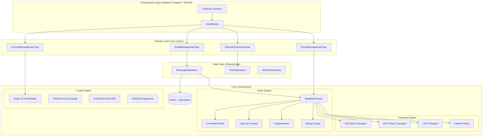

<!--
  =============================================================================
  MeshLink
  Secure Offline Mesh Communication Platform

  Copyright (c) 2026 Ayshi Shannidhya Panda.
  All Rights Reserved.

  MeshLink, the MeshLink Protocol, associated software, source code,
  documentation, algorithms, and design architecture are proprietary
  intellectual property of Ayshi Shannidhya Panda.

  Unauthorized reproduction, modification, distribution, or commercial
  exploitation of any part of this software or protocol is prohibited
  without prior written permission.

  Author  : Ayshi Shannidhya Panda
  =============================================================================
-->
# MeshLink — Next-Generation Offline Mesh Communication Platform

## Implementation Plan

### Goal
Build a production-grade Android application that enables decentralized peer-to-peer messaging using BLE mesh, Wi-Fi Direct, LAN, and optional internet relay — with end-to-end encryption, intelligent routing, and a premium Material 3 UI.

---

## Proposed Architecture



---

## Module Structure

| Module | Purpose |
|--------|---------|
| `:app` | Application entry, DI root, navigation |
| `:core:common` | Shared utilities, extensions, constants |
| `:core:crypto` | X25519, Ed25519, ChaCha20, Noise XX, HKDF |
| `:core:network` | Transport abstraction, packet protocol |
| `:core:mesh` | Routing, flooding, store-and-forward, dedup |
| `:core:database` | Room entities, DAOs, SQLCipher config |
| `:core:domain` | Use cases, domain models |
| `:core:ui` | Design system, theme, shared composables |
| `:feature:chat` | 1:1 and group messaging screens |
| `:feature:contacts` | Peer discovery, QR pairing, contact list |
| `:feature:settings` | App settings, identity, backup |
| `:feature:meshmap` | Mesh topology visualization |
| `:feature:devtools` | Developer console, packet logs, diagnostics |

---

## Proposed Changes (by Phase)

### Phase 1 — Project Skeleton & Build System

#### [NEW] Root `build.gradle.kts`
- Version catalog, Kotlin 2.0, Compose compiler plugin, Hilt

#### [NEW] `settings.gradle.kts`
- All module includes, dependency resolution

#### [NEW] `gradle/libs.versions.toml`
- Centralized dependency versions

#### [NEW] `:app` module
- `MeshLinkApp.kt` — Hilt application
- `MainActivity.kt` — Single activity, Compose navigation
- `MainNavGraph.kt` — Navigation routes

---

### Phase 2 — Core Crypto Engine

#### [NEW] `:core:crypto`
- `KeyPairGenerator.kt` — X25519 + Ed25519 key generation via Tink/Conscrypt
- `NoiseHandshake.kt` — Noise XX pattern implementation (3 messages)
- `NoiseSession.kt` — Symmetric cipher state with nonce tracking
- `NoiseCipher.kt` — ChaCha20-Poly1305 AEAD encrypt/decrypt
- `HkdfDeriver.kt` — HKDF-SHA256 key derivation
- `PacketSigner.kt` — Ed25519 packet signing and verification
- `ReplayGuard.kt` — Sliding window (2048-bit) replay protection
- `IdentityManager.kt` — Keychain storage via Android Keystore

> **Design Decision**: Using Tink for crypto primitives (Google's battle-tested library) rather than raw BouncyCastle. This gives us audited X25519, ChaCha20-Poly1305, and HKDF with hardware-backed key storage on supported devices.

---

### Phase 3 — Network Protocol & Packet Format

#### [NEW] `:core:network`

**Packet format (binary, big-endian):**
```
┌─────────────────────────────────────────────────────────┐
│ Version (1B) │ Type (1B) │ Flags (1B) │ TTL (1B)       │
├─────────────────────────────────────────────────────────┤
│ Sender ID (8B)                                          │
├─────────────────────────────────────────────────────────┤
│ Recipient ID (8B) — 0x00 for broadcast                  │
├─────────────────────────────────────────────────────────┤
│ Packet ID (8B) — unique per message                     │
├─────────────────────────────────────────────────────────┤
│ Timestamp (8B) — milliseconds since epoch               │
├─────────────────────────────────────────────────────────┤
│ Payload Length (2B)                                      │
├─────────────────────────────────────────────────────────┤
│ Payload (variable)                                      │
├─────────────────────────────────────────────────────────┤
│ Signature (64B) — Ed25519 over [Version..Payload]       │
│ (excludes TTL for relay compatibility)                  │
└─────────────────────────────────────────────────────────┘
```

**Files:**
- `MeshPacket.kt` — Packet data class + binary serialization
- `PacketType.kt` — Enum: ANNOUNCE, MESSAGE, HANDSHAKE, ENCRYPTED, FRAGMENT, ACK, SOS, FILE_CHUNK, ROUTE_REQUEST, ROUTE_REPLY
- `PacketCodec.kt` — Encode/decode with LZ4 compression
- `FragmentAssembler.kt` — Fragment reassembly with timeout
- `FragmentSplitter.kt` — Split packets > MTU into numbered fragments
- `TransportInterface.kt` — Abstract transport contract

---

### Phase 4 — Transport Implementations

#### [NEW] BLE Transport (`BleTransport.kt`)
- GATT Server + Client simultaneously
- Custom service UUID, read/write characteristics
- MTU negotiation (request 517)
- Scanning with duty cycling (scan 4s, pause 8s in normal; 2s/15s in low-power)
- Connection management with 7 concurrent links max
- Peripheral advertising with manufacturer data containing peer ID

#### [NEW] Wi-Fi Direct Transport (`WifiDirectTransport.kt`)
- `WifiP2pManager` for discovery + connection
- TCP socket channels for data transfer (10x BLE bandwidth)
- Automatic group owner negotiation
- Connection pooling

#### [NEW] LAN Transport (`LanTransport.kt`)
- mDNS/NSD service registration + discovery
- UDP broadcast for peer announcement
- TCP for reliable message delivery
- Works on shared Wi-Fi networks

#### [NEW] Transport Manager (`TransportManager.kt`)
- Priority-based transport selection
- Automatic failover: BLE → Wi-Fi Direct → LAN → Internet
- Health monitoring per transport
- Bandwidth estimation

---

### Phase 5 — Mesh Routing Engine

#### [NEW] `:core:mesh`
- `MeshRouter.kt` — Weighted shortest-path routing
  - **Scoring**: `score = α·RSSI + β·battery + γ·latency + δ·packetLoss + ε·congestion`
  - Configurable weights with adaptive tuning
- `FloodController.kt` — Controlled flood with:
  - TTL (default 7, clamped by local degree)
  - LRU dedup cache (2000 entries, 5-min expiry)
  - Random jitter (20-250ms, wider when dense)
  - Fanout subsetting (logâ‚‚ of degree for broadcasts)
  - Split-horizon (exclude ingress link)
- `StoreForwardManager.kt` — Encrypted packet queue
  - SQLCipher-backed persistence
  - Exponential backoff retry
  - TTL-based expiration (default 24h)
  - Delivery acknowledgment tracking
- `NeighborTable.kt` — Topology map
  - 60s freshness window
  - RSSI-weighted link quality
  - Bidirectional confirmation
- `RouteCache.kt` — Source route cache with expiration

---

### Phase 6 — Database Layer

#### [NEW] `:core:database`
- `MeshLinkDatabase.kt` — Room DB with SQLCipher
- **Entities:**
  - `MessageEntity` — id, senderId, recipientId, content (encrypted), timestamp, status, hopCount
  - `PeerEntity` — publicKey, displayName, lastSeen, rssi, transport, isFavorite
  - `ConversationEntity` — id, type (1:1/group), lastMessage, unreadCount
  - `PendingPacketEntity` — for store-and-forward queue
  - `RouteEntity` — cached routes with expiry
- **DAOs** with Flow-based reactive queries
- **Migrations** strategy for future schema changes

---

### Phase 7 — Domain Layer

#### [NEW] `:core:domain`
- Use cases: `SendMessage`, `ReceiveMessage`, `DiscoverPeers`, `EstablishSession`, `ExportBackup`, `ImportBackup`
- Domain models: `Message`, `Peer`, `Conversation`, `Identity`, `MeshStats`
- Repository interfaces (implemented in data layer)

---

### Phase 8 — UI Design System

#### [NEW] `:core:ui`
- `MeshLinkTheme.kt` — Material 3 dynamic color + custom palette
- `MeshLinkTypography.kt` — Inter/Outfit fonts
- Dark mode, AMOLED mode, dynamic color support
- Shared composables: `MeshStatusBar`, `PeerAvatar`, `EncryptionBadge`, `SignalStrengthIndicator`
- Animations: shimmer loading, message bubbles, connection ripples

---

### Phase 9 — Feature: Chat

#### [NEW] `:feature:chat`
- `ChatListScreen` — Conversations with unread badges, last message, online status
- `ChatScreen` — Message bubbles, input bar, voice note recorder, file attachment
- `ChatViewModel` — Reactive message flow, send/receive orchestration
- Message status: Sent → Relayed → Delivered → Read
- Typing indicators via mesh

---

### Phase 10 — Feature: Contacts & Discovery

#### [NEW] `:feature:contacts`
- `ContactListScreen` — Saved peers with online/offline status
- `DiscoveryScreen` — Nearby peer radar with RSSI visualization
- `QrPairingScreen` — Camera scanner + QR generator for identity exchange
- `PeerDetailScreen` — Encryption fingerprint, signal info, route

---

### Phase 11 — Feature: Settings & Identity

#### [NEW] `:feature:settings`
- `SettingsScreen` — Transport toggles, battery mode, appearance
- `IdentityScreen` — Key fingerprint, display name, avatar
- `BackupScreen` — Encrypted export/import
- `AboutScreen` — Version, licenses, mesh stats

---

### Phase 12 — Feature: Mesh Map

#### [NEW] `:feature:meshmap`
- `MeshMapScreen` — Canvas-based topology visualization
- Nodes as circles with signal-strength halos
- Animated edges showing active routes
- Hop count labels, latency overlays

---

### Phase 13 — Feature: Developer Tools

#### [NEW] `:feature:devtools`
- `DevConsoleScreen` — Live packet log stream
- `RoutingTableScreen` — Current routing table dump
- `TransportStatsScreen` — Per-transport bandwidth, error rates
- `ConnectionGraphScreen` — Real-time mesh graph

---

### Phase 14 — Testing

- **Unit tests**: Crypto (known test vectors), PacketCodec (round-trip), Router (path selection), FloodController (dedup, TTL)
- **Integration tests**: Room DAO queries, Store-and-forward lifecycle
- **UI tests**: Chat send flow, navigation, QR scanning mock

---

### Phase 15 — CI/CD & Release

- GitHub Actions workflow: lint, test, build, APK artifact
- ProGuard/R8 rules
- Signing configuration
- Version management

---

## Key Design Decisions

| Decision | Rationale |
|----------|-----------|
| **Tink for crypto** | Google-maintained, hardware keystore integration, audited primitives |
| **SQLCipher** | Encrypts entire database at rest — critical for a privacy-first app |
| **Noise XX** | Mutual authentication + forward secrecy + identity hiding in 3 messages |
| **LZ4 compression** | Fast compression ideal for real-time mesh packets on constrained links |
| **Multi-transport** | BLE alone has ~25KB/s max; Wi-Fi Direct adds ~250Mbps for nearby peers |
| **Weighted routing** | Battery-aware routing prevents draining relay nodes unfairly |
| **Store-and-forward** | Essential for DTN scenarios — messages survive network partitions |
| **Fanout subsetting** | log₂(degree) broadcast reduces O(n²) flood to O(n·log n) |

---

## Verification Plan

### Automated Tests
```bash
./gradlew test                    # Unit tests
./gradlew connectedAndroidTest   # Instrumented tests
./gradlew lint                   # Lint checks
```

### Manual Verification
- Install on 2+ Android devices
- Verify BLE peer discovery (devices find each other)
- Send message over BLE mesh
- Verify encryption (check packet logs show ciphertext)
- Test store-and-forward (send while recipient offline, verify delivery when online)
- Test Wi-Fi Direct fallback
- Verify UI on different screen sizes

---

> [!IMPORTANT]
> This is a very large project. The initial deliverable will be a **fully buildable, architecturally complete project** with working:
> - BLE mesh transport with peer discovery
> - Noise XX encrypted messaging
> - Store-and-forward with retry
> - Weighted mesh routing
> - Chat UI with Material 3
> - Contact discovery and QR pairing
> - Mesh topology visualization
> - Developer console
> - SQLCipher encrypted database
> - Comprehensive documentation
>
> Features like AI, voice notes, file transfer, and cross-platform are scaffolded with interfaces but will need iterative development.

---

## Open Questions

> [!NOTE]
> The following are design choices I've made based on best practices. Let me know if you'd prefer different approaches:
> 1. **Crypto library**: Using Google Tink (production-grade). Alternative: Lazysodium (libsodium wrapper). Preference?
> 2. **BLE Service UUID**: I'll generate a unique UUID. Should it match any existing mesh standard?
> 3. **Max TTL**: Default 7 hops (matches BitChat). Want higher for larger meshes?
> 4. **Store-and-forward TTL**: Default 24 hours. Preference?
> 5. **Min SDK 26 (Android 8)** vs **SDK 29 (Android 10)**: SDK 29 gives better BLE APIs but smaller user base.
